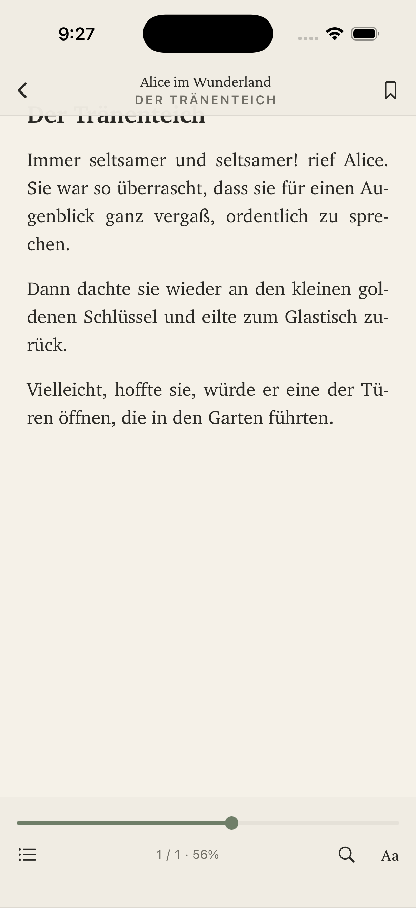
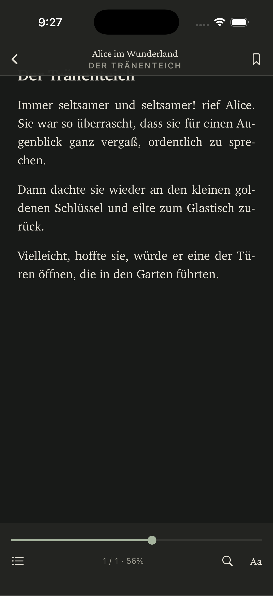
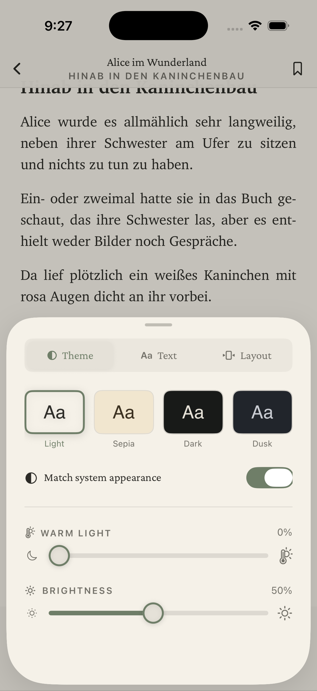
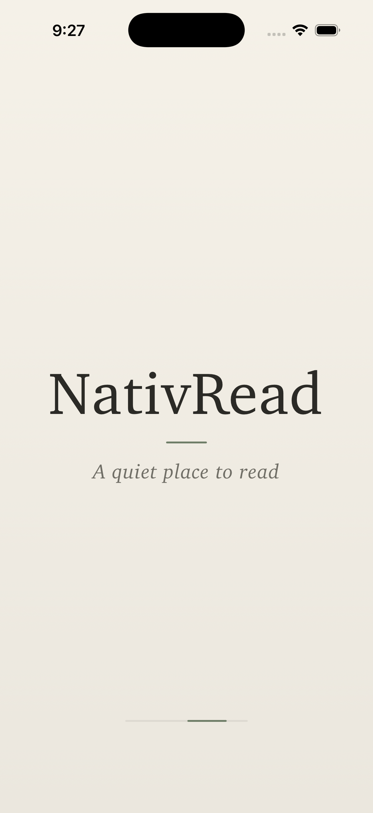
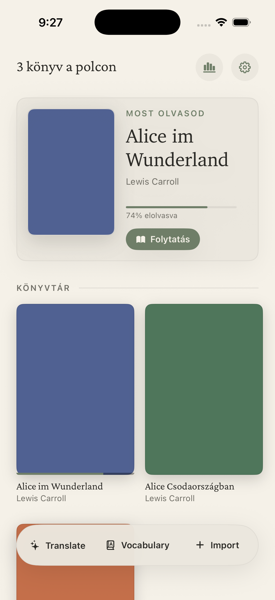

<div align="center">


# NativRead

**A calm, editorial EPUB reader for iPhone — built to the standard of Apple Books and Kindle, with real page-level pagination, an in-app language switch, and a typeface you'll actually want to read in.**


</div>

<div align="center">

| Library | Reader · Light | Reader · Dark |
|:---:|:---:|:---:|
|  |  |  |
| **Appearance panel** | **Language onboarding** | **Localized (Magyar)** |
|  |  |  |

</div>

---

## Highlights

### 🌍 Read in your language
Full **English** and **Magyar (Hungarian)** interface localization. The language is picked at first launch and applied everywhere — every `Text` follows your choice live, not just number and date formatting. A separate **dictionary (Define) language** lets the EN→HU dictionary back up Hungarian reading while the UI stays in whatever language you prefer.

### 📖 Real page-level reading
Chapters are laid out in viewport-wide CSS columns inside a `WKWebView`, and a small JS engine turns pages with compositor-friendly `translate3d` animations, reporting state back to Swift over a message bridge. Tap zones, swipe, an animated page turn, and seamless chapter boundaries — the way real readers work, not one-swipe-per-chapter.

- **Whole-book progress** weighted by chapter size, with a scrubber to jump anywhere (`Book.bookFraction` / `Book.position` are exact inverses, property-tested)
- **Reading flows**: paged (default) or continuous vertical scroll; page-turn animation choice — slide, fade, or instant (e-ink style)
- **Full-text search** across the whole book with snippets; tap a result to jump and highlight the match
- **Persistent highlights** anchored by text + occurrence (survive font, margin, and flow changes), plus bookmarks and TOC in one contents sheet

### 🎨 An editorial design system
- **Tabbed appearance panel** — Theme / Text / Layout, calm and uncrowded
- **Four reading atmospheres** — Light, Sepia, Dusk, Dark (true black) — and the chrome adopts the page colour so the whole screen reads as one sheet
- **Charter** serif body type with New York / Georgia / Palatino / San Francisco alternates; size 13–26, line height, margins, justification
- **App-wide appearance** — Light / Dark / System, with separate light/dark reader theme slots
- **Eye comfort** — warm-light slider (amber shift on any theme, page and chrome alike) and an in-app brightness slider

### 📚 Robust EPUB handling
Container → OPF → manifest/spine/metadata parsing with percent-encoded and fragment hrefs; EPUB 3 nav with EPUB 2 NCX fallback and a synthesised TOC for books with neither. Real cover extraction (EPUB 3 `cover-image`, EPUB 2 `meta name="cover"`, heuristic fallback) with deterministic generated covers for books without art. Failed imports roll back.

### 📄 PDFs and plain text
Beyond EPUB, NativRead opens **PDFs** and **plain-text files**.

- **PDF** — a fixed-layout PDFKit reader with tap-zone paging, a page scrubber, bookmarks, the document outline as a contents list, full-document search, and Define on selected text. Each page counts as one unit of progress, so the same whole-book scrubber and progress math work as they do for EPUBs. Dark themes invert the page while preserving image hues, so night reading stays comfortable instead of turning photos into negatives. Password-protected or unreadable PDFs are rejected on import with a clear error.
- **TXT** — a plain `.txt` is synthesised into a single chapter and flows into the same reflowable web reader as EPUBs, inheriting every theme, font, search, and Define for free. The title is taken from the first non-empty line.

---

## Architecture

```
NativRead/
├── NativReadApp.swift          — entry point, launch-argument test hooks
├── DesignSystem/               — BrandPalette, Spacing, Typography tokens (pure)
├── Models/                     — Book, ReadingProgress, Bookmark,
│                                 ReaderSettings, themes (pure value types)
├── EPUB/                       — EPUBParser + XML delegates (pure)
├── Services/
│   ├── LibraryStore.swift      — import / unzip / persist (@Observable)
│   ├── PDFImporter.swift       — PDF → Book (PDFKit, page-per-spine)
│   ├── TextImporter.swift      — TXT → synthesised reflowable chapter
│   ├── NightInvertPDFPage.swift— dark-theme PDF page inversion
│   ├── SettingsStore.swift     — appearance & typography persistence
│   ├── LocalizationStore.swift — app + dictionary language, persisted
│   ├── BundleLanguage.swift    — main-bundle .lproj routing for live switch
│   ├── DictionaryProvider.swift— bundled bilingual dictionaries (WordNet, EN→HU)
│   ├── ReaderStyle.swift       — CSS generator (pure, tested)
│   ├── ReaderScripts.swift     — JS pagination engine
│   ├── ReaderController.swift  — WKWebView bridge
│   └── SearchService.swift     — whole-book search (pure, tested)
└── Views/
    ├── Onboarding/             — splash + language selection
    ├── Library/                — shelf, covers, import
    ├── Settings/               — appearance, language, dictionary
    └── Reader/                 — EPUB reader + PDFReaderView (PDFKit),
                                  chrome, tabbed appearance panel
```

The whole app is value-types-first: models and EPUB parsing are pure and unit-tested; stores are `@Observable`; side effects live behind a thin service layer.

---

## Getting started

```bash
brew install xcodegen
xcodegen generate
open NativRead.xcodeproj      # ⌘R on a simulator or device
```

Requires Xcode 16+ and iOS 17. Dependency: ZIPFoundation (resolved by SPM on first build).

## Testing

```bash
xcodebuild test -project NativRead.xcodeproj -scheme NativRead \
  -destination 'platform=iOS Simulator,name=iPhone 17 Pro'
```

- **214 unit tests** — EPUB 2/3 parsing, TOC (nav + NCX), cover detection, error paths, progress-math round-trips, settings persistence + migration, CSS generation (paged + scroll), warmth colour math, highlight locators, search, the full localization layer (language defaults, persistence, locale/bundle resolution, dictionary mapping), plus PDF/TXT import + the PDF reader (format routing, metadata/cover, text synthesis + HTML escaping, encoding fallback, page-clamp/persistence math, search, bookmarks, night-invert colour math)
- **22 UI tests** — language onboarding, splash skip, seeded shelf, page turn + progress restore, theme switching across the tabbed panel, flow/transition pickers, scroll journey, highlight persistence, TOC navigation, whole-book search, bookmarking, vocabulary, and the PDF reader journey

**Launch-argument hooks** (UI tests + screenshot automation):
`-resetLibrary`, `-resetSettings`, `-resetLanguage`, `-seedSampleBook`, `-seedProgress`,
`-seedSampleVocabulary`, `-skipOnboarding`, `-forceOnboarding`, `-onboardingHold`,
`-seedAliceBooks`, `-autoOpenFirstBook`, `-forceTheme <paper|sepia|dusk|ink>`, `-forceFlow <paged|scroll>`,
`-forceTransition <slide|fade|instant>`, `-forceLanguage <en|hu>`,
`-showTypographyPanel`, `-appearanceTab <theme|text|layout>`.

Sample books are generated by `scripts/make_sample_epub.py`.

## Adding books

- **Files app / Share sheet** — open any `.epub`, `.pdf`, or `.txt` with NativRead
- **In-app** — the **+** button on the shelf (multi-select supported)
