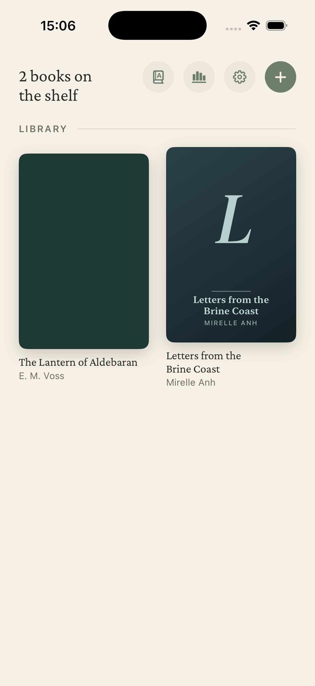
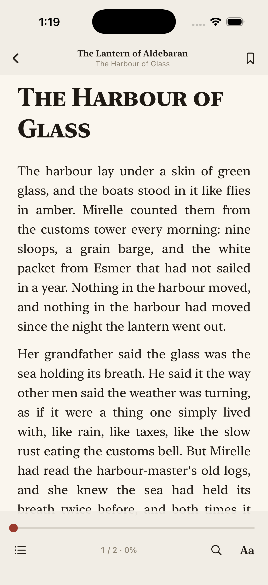
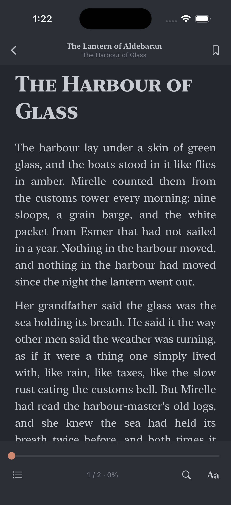
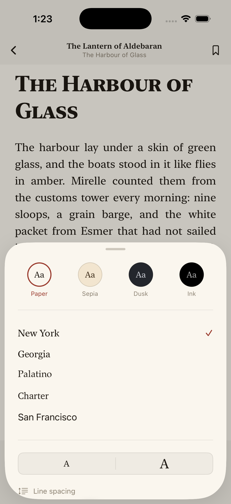

# Quire

Quire (formerly LumenRead): a fast, beautiful EPUB reader for
iPhone, built to the standard of the best readers on the market
(Apple Books, Kindle, Readest).

| Library | Paper | Dusk | Typography |
|---|---|---|---|
|  |  |  |  |

## What's new versus v1

The old app paginated **per chapter** (one swipe = one whole chapter).
The new reading engine paginates **per page** the way real readers do:
chapters are laid out in viewport-wide CSS columns inside a WKWebView
and a small JS engine (`window.lumen`) turns pages with
compositor-friendly `translate3d` animations, reporting state back to
Swift over a message bridge.

- **Page-level pagination** with tap zones (left/right edge), swipe,
  and an animated page turn; seamless across chapter boundaries
- **Whole-book progress** weighted by chapter size, with a scrubber to
  jump anywhere in the book (`Book.bookFraction` / `Book.position`
  are exact inverses, property-tested)
- **Four reading themes** — Paper, Sepia, Dusk, Ink (true black) —
  and the chrome adopts the page colour so the whole screen reads as
  one sheet
- **Typography control**: New York / Georgia / Palatino / Charter /
  San Francisco, font size 13–26, line height, margins, justification
- **Full-text search** across the whole book with snippets; tapping a
  result jumps to the page and highlights the match
- **Bookmarks** with automatic text snippets, listed next to the TOC
- **TOC** from the EPUB 3 nav document with EPUB 2 NCX fallback and a
  synthesised fallback for books that ship neither
- **Library** with real cover extraction (EPUB 3 `cover-image`,
  EPUB 2 `meta name="cover"`, heuristic fallback) and deterministic
  generated covers for books without art
- **Robust EPUB parsing**: container → OPF → manifest/spine/metadata,
  percent-encoded hrefs, fragment hrefs, failed imports roll back

## Quire additions on top of LumenRead 2.0

Feature choices driven by market research (Apple Books / Kindle /
KyBook / Readest user feedback):

- **Eye comfort**: warm-light slider (amber shift on any theme, in
  page and chrome alike), match-system-appearance mode with separate
  light/dark theme slots, and an in-app brightness slider
- **Reading flows**: paged (default) or continuous vertical scroll;
  page-turn animation choice — slide, fade, or instant (e-ink style)
- **Selection tools**: native text selection with the system edit menu
  — Copy, Look Up (dictionary), Translate (Apple on-device) — plus a
  custom **Highlight** action
- **Persistent highlights** anchored by text + occurrence (survive
  font, margin and flow changes), listed in the contents sheet next to
  TOC and bookmarks

## Architecture

```
Quire/
├── QuireApp.swift            — entry, launch-argument test hooks
├── Models/                       — Book, ReadingProgress, Bookmark,
│                                   ReaderSettings, themes (pure)
├── EPUB/                         — EPUBParser + XML delegates (pure)
├── Services/
│   ├── LibraryStore.swift        — import/unzip/persist (@Observable)
│   ├── SettingsStore.swift       — typography persistence
│   ├── ReaderStyle.swift         — CSS generator (pure, tested)
│   ├── ReaderScripts.swift       — JS pagination engine
│   ├── ReaderController.swift    — WKWebView bridge
│   └── SearchService.swift       — whole-book search (pure, tested)
└── Views/
    ├── Library/                  — shelf, covers, import
    └── Reader/                   — reader, chrome, panels, sheets
```

## Setup

```bash
brew install xcodegen
cd Quire
xcodegen generate
open Quire.xcodeproj   # Cmd+R on a simulator or device
```

Dependency: ZIPFoundation (resolved by SPM on first build).

## Testing

```bash
xcodebuild -project Quire.xcodeproj -scheme Quire \
  -destination 'platform=iOS Simulator,name=iPhone 17 Pro' test
```

- **46 unit tests**: EPUB 2/3 parsing, TOC (nav + NCX), cover
  detection, error paths, progress math round-trips, settings
  persistence and legacy-settings migration, CSS generation (paged +
  scroll), warmth colour math, highlight locators, search
- **9 UI tests** (`ReaderJourneyUITests`): seeded shelf, page turn +
  progress restore, theme switching, flow/transition pickers, scroll
  journey, selection highlighting + persistence, TOC navigation,
  whole-book search, bookmarking

Test hooks (launch arguments): `-resetLibrary`, `-resetSettings`,
`-seedSampleBook`, `-autoOpenFirstBook`,
`-forceTheme <paper|sepia|dusk|ink>`, `-forceFlow <paged|scroll>`,
`-forceTransition <slide|fade|instant>`, `-showTypographyPanel`.

The sample books are generated by `scripts/make_sample_epub.py`;
the app icon by `swift scripts/make_icon.swift <out.png>`.

## Adding books

- **Files app / Share sheet** — open any `.epub` with Quire
- **In-app** — the + button on the shelf (multi-select supported)
